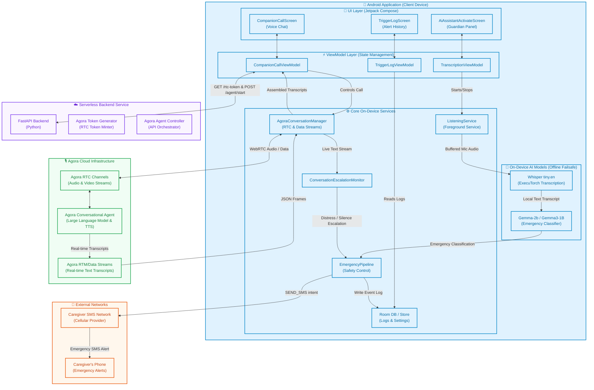

# SentriAI: Warm AI Companionship & On-Device Emergency Safety for Elders

***Submitted to the [AI Mobile Coders: Voice AI Hackathon](https://aimobilecoders.com/hackathons/voice-ai-hackathon).***

SentriAI is an Android application designed for elderly care, combining supportive companion conversations with real-time safety monitoring. It leverages a hybrid voice architecture to deliver both **highly personalized active voice companionship** (via the **Agora Conversational AI Engine**) and **completely private, offline emergency detection** (via local **ExecuTorch**, **Whisper**, and **Gemma** models).

### 📖 Project Documentation
*   **[Product Requirements Document (PRD)](file:///Users/spritle/.gemini/antigravity-ide/brain/d7409a7a-0aa1-4ce2-ab13-6a5f381af0fe/prd.md)**: Product vision, user personas, detailed functional specifications, and design criteria.
*   **[System Architecture Document](file:///Users/spritle/.gemini/antigravity-ide/brain/d7409a7a-0aa1-4ce2-ab13-6a5f381af0fe/system_architecture.md)**: High-fidelity infographic overview, layer-by-layer system flowcharts, and technical boundaries.
*   **[Agora Engine Integration (AGORA.md)](file:///Users/spritle/AndroidStudioProjects/SentriAI/AGORA.md)**: Acoustic optimization scenarios, data channel reassembly protocols, and escalation latch monitoring.
*   **[Offline AI Models (MODELS.md)](file:///Users/spritle/AndroidStudioProjects/SentriAI/MODELS.md)**: ExecuTorch runtime setup, models compilation flow, and CPU/GPU memory layouts.

---

## 🌟 Hackathon Highlights (Focus on Agora)

SentriAI implements the state-of-the-art **Agora Conversational AI Engine** as the core of its active care experience. Rather than treating voice AI as an isolated chatbot, SentriAI weaves it directly into the device's care schedule and emergency safety pipelines:

*   **Dynamic Prompt & Context Injection**: When starting a call, the app loads the elder's actual daily care plan (medications, meals, caregiver details) from the local database, builds a custom system prompt on-device, and passes it to the Agora agent at join-time. The agent's memory is updated dynamically *without* storing private schedules in a cloud database.
*   **Low-Latency RTC Data Stream Transcriptions**: Instead of adding heavyweight signaling dependencies, SentriAI captures conversation transcripts streamed directly over the RTC data channel. The on-device `ConversationMessageParser` reassembles these frames in real-time to drive the UI.
*   **Smart Acoustic Integration (`Constants.AUDIO_SCENARIO_AI_CLIENT`)**: SentriAI uses Agora's dedicated AI client audio profile, which optimizes acoustic echo cancellation (AEC) and noise suppression specifically for synthetic remote TTS voices playing over speakerphone.
*   **Active-Call Escalation Latch**: A specialized `ConversationEscalationMonitor` runs alongside the live call, triggering immediate caregiver SMS alerts if:
    1.  The elder utters a **critical distress phrase**.
    2.  The Agora agent injects a structured alert token (`[[SENTRI_ALERT:...]]`) into the data stream.
    3.  An **elevated distress phrase** (e.g., *"I feel dizzy"*) is followed by **12 seconds of silence**.

---

## 🏗️ System Architecture

A high-level blueprint of the hybrid system architecture, showing the division of responsibilities between client device layers, local AI models, serverless FastAPI coordinators, and Agora real-time conversational nodes:



For a comprehensive design breakdown and a visually rich high-fidelity system overview infographic, please refer to the dedicated [System Architecture Document](file:///Users/spritle/.gemini/antigravity-ide/brain/d7409a7a-0aa1-4ce2-ab13-6a5f381af0fe/system_architecture.md).

---

## 🚀 Key Features & Paths

SentriAI provides two independent pathways through the app, balancing rich interactive cloud companionship with failsafe offline background monitoring:

### 1. The Active Pathway: Companion & Emergency Calls
*   **Agora Voice Companion**: Users can place full-duplex live companion calls with a warm, natural-sounding AI companion.
*   **Emergency Mode & Supportive Companion**: When the elder presses the physical SOS button on-screen, the app immediately dispatches a caregiver alert SMS via a non-cancellable background task. Simultaneously, if Agora is configured and microphone permission (`RECORD_AUDIO`) has already been granted, the app launches a live, supportive companion call with an emergency Agora agent to keep them company and offer comfort until help arrives. *(Note: To ensure immediate alert delivery without showing blocking system dialogs to a panicked user, the emergency screen checks for mic permission silently rather than prompting for it. Mic permission is requested during normal Companion calls).*

### 2. The Passive Pathway: On-Device Emergency Safety
*   **Local Microphone Loop**: A foreground service (`ListeningService`) captures microphone input and feeds a local Voice Activity Detector (VAD).
*   **Whisper Speech-to-Text**: When speech is detected, the raw PCM audio is transcribed locally using **Whisper-tiny.en** exported via **PyTorch ExecuTorch**.
*   **Gemma-3-1B Classifier**: The transcript is evaluated offline by an on-device **Gemma-3-1B** model to determine if an emergency is occurring.
*   **Caregiver Notification**: The app immediately sends an SMS to the caregiver containing the distress phrase, classification confidence, and a localized log.

---

## 📁 Repository Structure & Key Code Links

The project is structured into three main components: the Android App, the FastAPI Agora backend, and the local model hosting utilities.

### 📱 Android Application (`/app`)
*   [AgoraConversationManager.kt](file:///Users/spritle/AndroidStudioProjects/SentriAI/app/src/main/java/com/example/sentriai/agora/AgoraConversationManager.kt): Manages the global RTC engine lifecycle, channel joins/leaves, volume indications, and stream transcript callbacks.
*   [AgoraSessionRepository.kt](file:///Users/spritle/AndroidStudioProjects/SentriAI/app/src/main/java/com/example/sentriai/agora/AgoraSessionRepository.kt): Coordinates API requests either directly to Agora's endpoints (debug mode) or to the production FastAPI backend.
*   [ConversationEscalationMonitor.kt](file:///Users/spritle/AndroidStudioProjects/SentriAI/app/src/main/java/com/example/sentriai/engine/ConversationEscalationMonitor.kt): Implements the conversational alert latch, distress keyword analysis, and the silence-after-distress watchdog timer.
*   [AgentPromptBuilder.kt](file:///Users/spritle/AndroidStudioProjects/SentriAI/app/src/main/java/com/example/sentriai/agora/AgentPromptBuilder.kt): Builds personalized prompts injecting the elder's daily meals, medicines, and caregiver names.
*   [EmergencyPipeline.kt](file:///Users/spritle/AndroidStudioProjects/SentriAI/app/src/main/java/com/example/sentriai/engine/EmergencyPipeline.kt): Orchestrates the 2-stage offline detection (Stage 1: Detector -> Stage 2: Formatter & SMS Dispatcher).

### ⚙️ FastAPI Agora Backend (`/agora-backend`)
*   [main.py](file:///Users/spritle/AndroidStudioProjects/SentriAI/agora-backend/main.py): A lightweight service that handles secure configuration, signs RTC tokens with the App Certificate, and proxies agent management requests to Agora.
*   [README.md](file:///Users/spritle/AndroidStudioProjects/SentriAI/agora-backend/README.md): Detailed installation, local tunneling (ngrok), environment variables, and deployment instructions for the backend.

### 🧠 On-Device Models & Local Testing (`/model-hosting`)
*   [MODELS.md](file:///Users/spritle/AndroidStudioProjects/SentriAI/MODELS.md): Details the PyTorch ExecuTorch exports for Whisper, model sizes, gated Hugging Face setup, and local download utilities.

---

## 🛠️ Setup & Installation

### 1. Build Requirements
*   **Android Studio Jellyfish / Ladybug** or newer.
*   **Android SDK 37** (Min SDK 24).
*   An **arm64-v8a** physical Android device (necessary for PyTorch ExecuTorch native code).

### 2. Configure Credentials
Add your credentials to `local.properties` (gitignored) at the project root:

```properties
# --- Agora Conversational AI Configuration ---
agoraAppId=YOUR_AGORA_APP_ID
agoraPipelineId=YOUR_AGORA_STUDIO_AGENT_PIPELINE_ID
agoraBackendUrl=https://YOUR_BACKEND_SERVICE.example.com
agoraLlmStyle=gemini  # Set to "gemini" if using Gemini/Vertex AI, leave blank for OpenAI

# --- Debug-Only Direct to Agora Credentials (Not for Release) ---
agoraCustomerId=YOUR_AGORA_REST_CUSTOMER_ID
agoraCustomerSecret=YOUR_AGORA_REST_CUSTOMER_SECRET

# --- Hugging Face Model Downloads (Debug Builds) ---
hfToken=hf_YOUR_HUGGING_FACE_READ_TOKEN
```

### 3. Run the Agora Backend Locally
To run the serverless FastAPI token service locally and expose it to the mobile emulator or device:

```bash
cd agora-backend
python3 -m venv .venv
source .venv/bin/activate
pip install -r requirements.txt
cp .env.example .env  # Fill in your AGORA_APP_ID, AGORA_APP_CERTIFICATE, etc.
set -a && source .env && set +a
uvicorn main:app --host 0.0.0.0 --port 8080
```

Expose the server using `ngrok` so the physical device can communicate with it:
```bash
ngrok http 127.0.0.1:8080
```
Copy the resulting `.ngrok-free.app` URL and paste it into `agoraBackendUrl` in your `local.properties`.

---

## 🧪 Detailed Setup and Specifications

For a deeper dive into the setup and code details, please refer to the dedicated logs:
*   [AGORA.md](file:///Users/spritle/AndroidStudioProjects/SentriAI/AGORA.md) — Comprehensive guide on creating the agent in Agora Agent Studio, response override details, transcript parsing schemas, and known limitations.
*   [MODELS.md](file:///Users/spritle/AndroidStudioProjects/SentriAI/MODELS.md) — Step-by-step export commands for Whisper tiny.en, Mel spectrogram preprocessing configurations, and local hosting verification.
